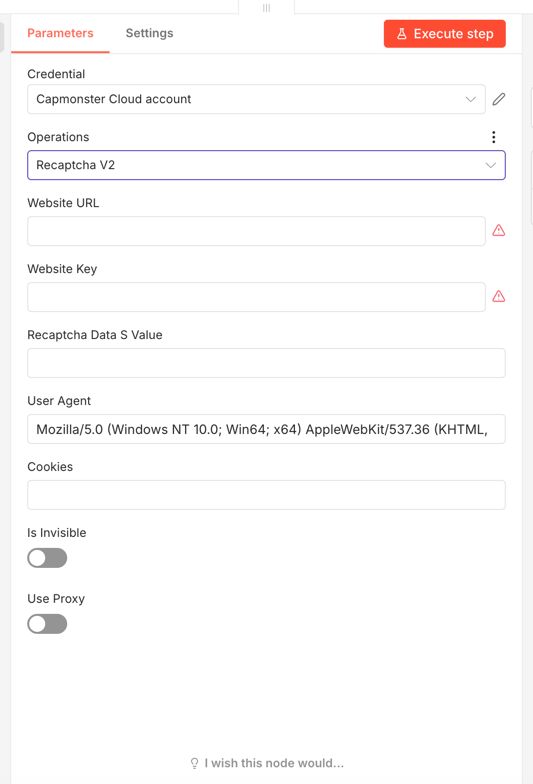
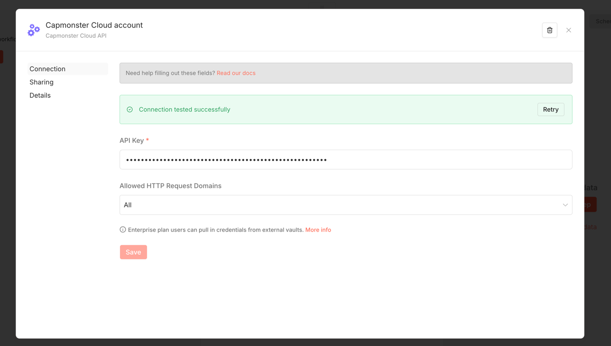

# n8n-nodes-capmonstercloud

CapMonster Cloud community node for n8n.  
Use this node to solve supported CAPTCHA challenges through the CapMonster Cloud API.

## Requirements

- n8n with community nodes enabled
- A CapMonster Cloud account
- A valid CapMonster Cloud API key

## Installation

Install the package as a community node in n8n:

```bash
npm install @zennolab_com/n8n-nodes-capmonstercloud
```

You can also install it from the n8n Community Nodes UI.

## Credentials

This node uses one credential:

- **CapMonster Cloud API**
  - `Client Key`: your API key from [CapMonster Cloud Dashboard](https://dash.capmonster.cloud)

## Supported operations

The node provides multiple task types, including:

- JSON (custom task payload)
- Recaptcha V2 and Recaptcha V2 Enterprise
- Recaptcha V3 and Recaptcha V3 Enterprise
- GeeTest V3 and GeeTest V4
- Cloudflare Turnstile (token, managed challenge, waiting room)
- Image to Text
- Complex image tasks (click and recognition)
- Additional task types such as DataDome, Basilisk, TenDI, Amazon variants, Binance, Imperva, Prosopo, Temu, Yidun, MTCaptcha, Altcha, FunCaptcha, Castle, TSPD, and Hunt

Some task types support optional proxy parameters.

## Usage

1. Add **CapMonster Cloud** node to your workflow.
2. Select or create **CapMonster Cloud API** credentials.
3. Choose a task type in **Task Type**.
4. Fill required fields for the selected task.
5. Execute the node.

The node creates a task, polls CapMonster Cloud until completion, and returns the solution in the node output.

## JSON task example

When using the JSON operation, provide a valid CapMonster task object without `clientKey`:

```json
{
	"type": "RecaptchaV2Task",
	"websiteURL": "https://lessons.zennolab.com/captchas/recaptcha/v2_simple.php?level=high",
	"websiteKey": "6Lcg7CMUAAAAANphynKgn9YAgA4tQ2KI_iqRyTwd"
}
```

## Output

The node returns the solved task response from CapMonster Cloud, including solution fields for the selected task type.

## Troubleshooting

- Verify your API key is valid and active.
- Confirm all required fields for the selected task type are provided.
- For JSON tasks, ensure the payload is valid JSON and matches the API schema.
- If a task requires proxy data, provide a working proxy host, port, and protocol.

## Optional UI examples

You can use the screenshots below as a quick visual reference for node setup in n8n.

### Node and task type selection



### Credentials configuration



## Documentation

- [CapMonster Cloud Documentation](https://docs.capmonster.cloud/)
- [CapMonster CAPTCHA task reference](https://docs.capmonster.cloud/docs/captchas/)
- [n8n Community Nodes Guide](https://docs.n8n.io/integrations/community-nodes/)

## License

[MIT](LICENSE)
